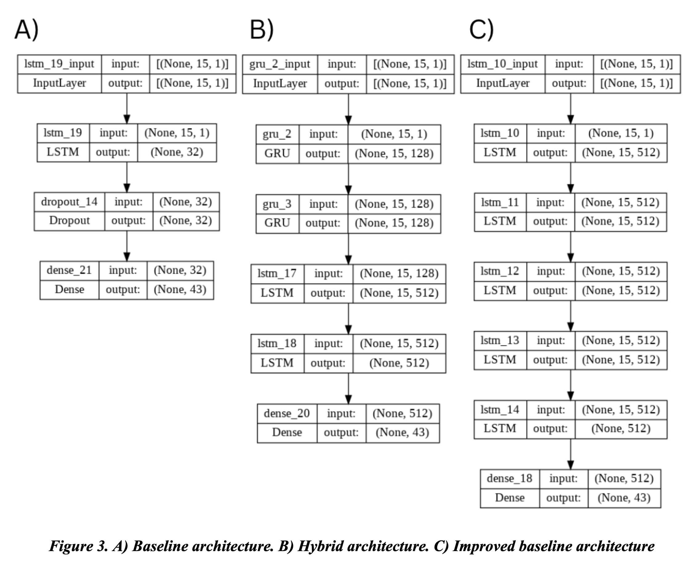
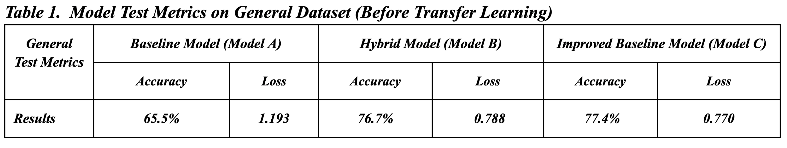
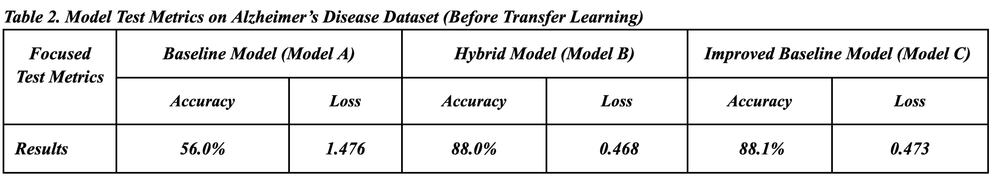
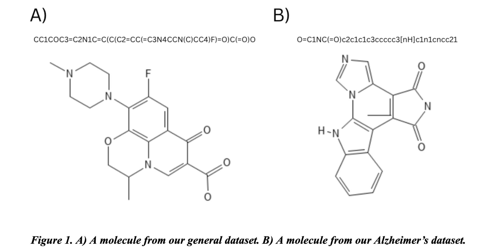

# A Generative Deep Learning Approach for Alzheimer’s Disease Drug Discovery
Current drug discovery efforts revolve around a time-intensive timeline that can take 10-15 years, oftentimes longer for complex neurological diseases like Alzheimer’s disease. This is a direct result of the large chemical space (approximately 1060 possible drug-like molecules) to be explored. In current drug discovery procedures, candidate compounds are oftentimes empirically selected from the general chemical space, an inefficient approach. 

With the development of deep learning as an efficient method to process large amounts of data, recent research has proposed the use of deep learning approaches to accelerate the drug discovery process. Specifically, new research has demonstrated the potential for generative deep learning approaches in novel chemical generation using natural language processing (NLP) methodologies

In our project, we decided to implement three models from scratch in order to rigorously test our hypothesis. 
* First, we implemented our own baseline model (Model A) consisting of one LSTM layer of 32 units and one dropout layer with a probability of 0.2 (Figure 3A). This baseline not only offered a point of comparison but gave us a foundation to work off of for our more complex models. 
* For our novel model (Model B), we combine a sequence of gated recurrent unit (GRU) layers, with 128 units,  and a sequence of LSTM layers consisting of 512 units(Figure 3B). We explored the efficacy of this unique combination because previous papers have highlighted the use case of both GRU and LSTM layers for molecular generation, but none explored their use case in conjunction. 
* Our third model (Model C) consisted of only LSTM layers with 512 units, and was a more complex version of our baseline model with five LSTM layers (Figure 3C). All of our models had the same Dense output layer of 43 units to represent the 43 output possibilities of our dataset. 

     

On our generic data, prior to transfer learning, we evaluated our three models’ abilities to learn nonspecific chemical syntax from our generic test dataset. Our baseline model (Model A) achieved an accuracy of 65.5% while the loss remained at 1.193. Using this as our point of reference for developing future models, we then evaluated our hybrid model (Model B) on the same test dataset, achieving an accuracy of 76.7% and a loss of 0.788. Lastly, we evaluated our improved baseline model (Model C) and achieved an accuracy of 77.4% and a loss of 0.770 (Table 1).

     

After transfer learning, we evaluated our three models’ abilities to learn specific chemical features specific to Alzheimer’s disease from our Alzheimer’s test dataset. Our baseline model (Model A) achieved an accuracy of 56.0% while the loss remained at 1.476. Using this as our point of reference for developing future models, we then evaluated our hybrid model (Model B) on the same test dataset, achieving an accuracy of 88.0% and a loss of 0.468. Lastly, we evaluated our improved baseline model (Model C) and achieved an accuracy of 88.1% and a loss of 0.473 (Table 2).

     

Using our improved baseline model (Model C), we generated 18 new molecules using randomly selected fragments from our Alzheimer’s dataset. We drew two of these molecules into chemical structures as examples (Figure 4).  

     

## Baseline
Code for our baseline model can be found at baseline_lstm.py

[Baseline Training Code](baseline_lstm.py)

## Improved Baseline
Code for our improved LSTM model can be found at improved_lstm.py.

[Improved Training Code](improved_lstm.py)

## Hybrid
Code for our Hybrd GRU/LSTM model can be found at hybrid_lstm.py.

[Improved Training Code](hybrid_lstm.py)

## Transfer Learning
These files are responsible for using the alzheimers data to transfer learn to generate more specific chemical structures

[Baseline Transfer Learning Code](TL_baseline_lstm.py) 
[Improved Transfer Learning Code](TL_improved_lstm.py) 
[Hybrid Training Code](TL_hybrid.py)

## Evaluation
These two files are responsible for using the test data to evaluate both our general models and the ones we transfered learned 
[Evaluate General](evaluateModelGeneralDataset.py) 
[Evaluate Transfer learn](evaluateModelsSpecificDataset.py)

## Molecule Generation
To generate molecules, we can run this file to generate 100 and filter those that are valid

[Molecule Generation](molecule_generator.py)
